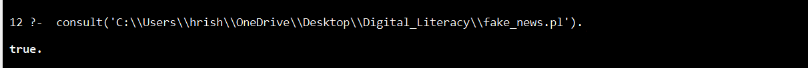

# CS_AI-ML
# Fake News Detection System - CS_AI-ML

**Name**: Hrishi Upadhyay  
**Registration No**: 25BCE10275  
**Year**: First Year  
**Branch-** B.Tech Computer Science  
**Course Code**: CSA2001

A rule-based AI system implemented in Prolog for detecting fake news using logical inference, suspicious keywords, and source credibility checks. Classifies news as **Real**, **Fake**, or **Uncertain**.

## Features

- Symbolic AI approach with Prolog facts and rules
- Analyzes news text for suspicious keywords
- Evaluates source credibility
- Transparent decision-making via logical rules

## Prerequisites

- SWI-Prolog (version 8.x or higher)
- Text editor (VS Code, Notepad++)

## Setup

1. Install SWI-Prolog: [swi-prolog.org](https://www.swi-prolog.org/download/stable)
2. Verify `fake_news_detector.pl` is present
3. 

## Usage

1. Launch Prolog:
2. Query examples:
```prolog
?- classify_news("shocking viral news click here", "randomblog").
% Output: fake

?- classify_news("government releases new policy", "bbc").
% Output: real
```


## Test Cases

| News Text                  | Source    | Expected Output |
|----------------------------|-----------|-----------------|
| shocking viral news click here | randomblog | Fake |
| government releases new policy | bbc     | Real |
| new technology launched    | unknown   | Uncertain |

## System Rules

- **Fake**: Suspicious keywords + untrusted source
- **Real**: Trusted source + no suspicious keywords
- **Uncertain**: All other cases

## Student Information

**Submitted by**: Hrishi Upadhyay  
**Reg No**: 25BCE10275  
**Academic Year**: First Year

## Limitations

- Basic pattern matching (no NLP)
- Static knowledge base

## Future Work

- ML integration
- Web GUI
- Real-time analysis

## References

SWI-Prolog docs & AI materials
